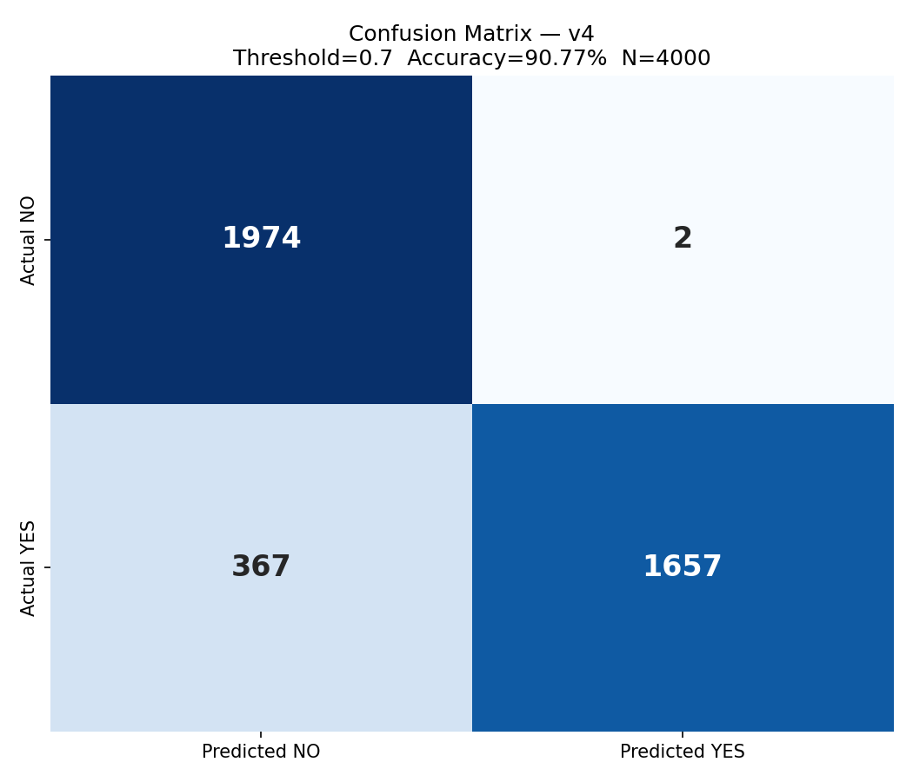
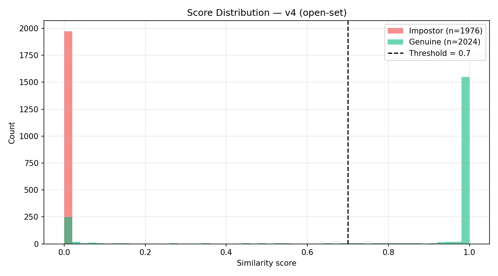
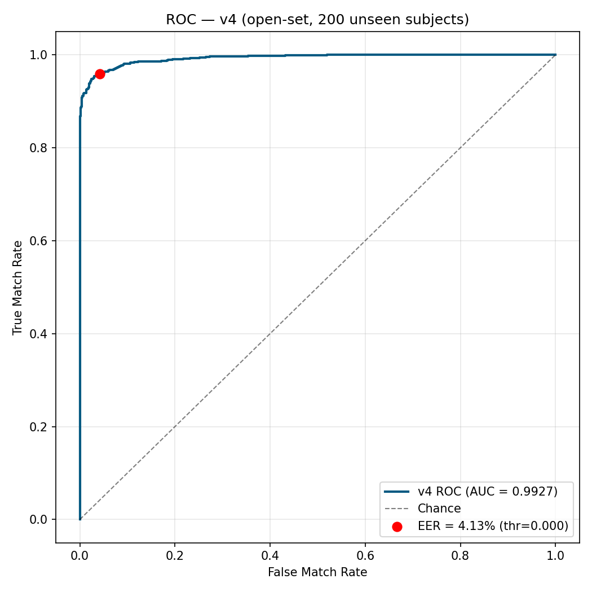
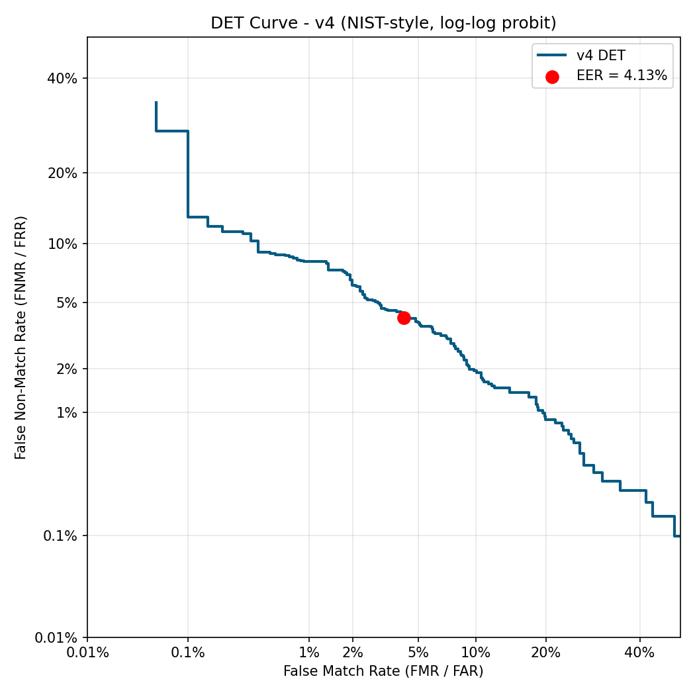
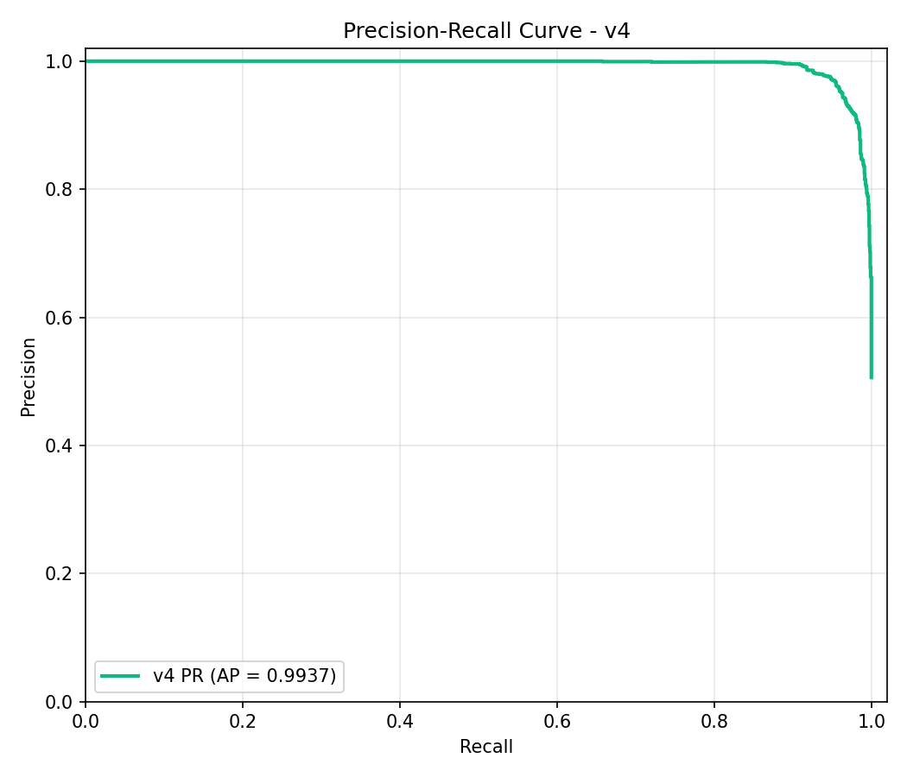
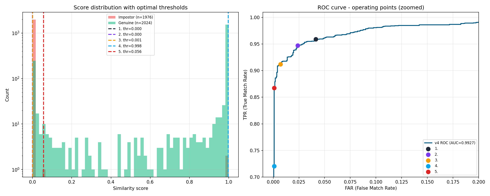

# คู่มือการวัดผลโมเดลลายนิ้วมือ V4 (ฉบับพื้นฐาน)

> เขียนสำหรับคนที่ไม่มีพื้นฐาน machine learning
> ใช้ตัวเลขจริงจากโปรเจ็ค V4 เป็นตัวอย่างทั้งหมด
> เหมาะสำหรับพริ้นอ่าน

---

## สารบัญ

1. [โมเดลของคุณทำอะไร (ภาพรวม)](#1-โมเดลของคุณทำอะไร)
2. [ศัพท์พื้นฐานที่ต้องรู้ 10 คำ](#2-ศัพท์พื้นฐาน-10-คำ)
3. [Confusion Matrix — รากฐานของทุกอย่าง](#3-confusion-matrix)
4. [เมตริกที่คำนวณจาก Confusion Matrix](#4-เมตริกจาก-confusion-matrix)
5. [Threshold — สวิตช์ที่เปลี่ยนทุกตัวเลข](#5-threshold)
6. [กราฟ ROC คืออะไร](#6-roc-curve)
7. [กราฟ DET คืออะไร](#7-det-curve)
8. [กราฟ PR (Precision-Recall) คืออะไร](#8-pr-curve)
9. [เมตริกที่ไม่ผูกกับ threshold](#9-เมตริกที่ไม่ผูกกับ-threshold)
10. [วิธีเลือก Threshold ที่ดีที่สุด](#10-การเลือก-threshold)
11. [สรุปทั้งหมดเป็นตารางเดียว](#11-cheat-sheet)
12. [อภิธานศัพท์](#12-glossary)

---

## 1. โมเดลของคุณทำอะไร

**ปัญหาที่โมเดลแก้:** "ภาพลายนิ้วมือ 2 ภาพนี้ มาจากนิ้วเดียวกันไหม?"

```
   ภาพ A ─┐
          ├──► [โมเดล V4] ──► score (0.00 ถึง 1.00)
   ภาพ B ─┘
```

**ไม่ใช่** การถามว่า "นี่คือนิ้วของใคร" (แบบนั้นต้องมี class 600 คน)
**แต่เป็น** การถามว่า "ใช่/ไม่ใช่" (2 ทางเลือกเท่านั้น — เรียกว่า **binary verification**)

### Output ของโมเดล

- ค่า **0.00–1.00** เรียกว่า **similarity score** หรือ **confidence**
- ใกล้ **1.00** → โมเดลมั่นใจว่า "ใช่ นิ้วเดียวกัน"
- ใกล้ **0.00** → โมเดลมั่นใจว่า "ไม่ใช่"
- ค่ากลาง ๆ เช่น 0.5 → โมเดลไม่แน่ใจ

### ปัญหา: เราจะรู้ได้ยังไงว่าตอบ "ใช่" หรือ "ไม่ใช่"?

**คำตอบ:** ตั้ง **threshold** (เส้นแบ่ง) เช่น 0.70
- ถ้า score ≥ 0.70 → ตอบ "ใช่"
- ถ้า score < 0.70 → ตอบ "ไม่ใช่"

---

## 2. ศัพท์พื้นฐาน 10 คำ

| ศัพท์ | แปล / หมายถึง |
|---|---|
| **Genuine pair** | คู่ภาพที่ "ใช่" (นิ้วเดียวกันจริง) — ground truth = 1 |
| **Impostor pair** | คู่ภาพที่ "ไม่ใช่" (คนละนิ้ว) — ground truth = 0 |
| **Positive / Negative** | Positive = ตอบ "ใช่" | Negative = ตอบ "ไม่ใช่" |
| **True / False** | True = ทายถูก | False = ทายผิด |
| **Score** | ตัวเลขที่โมเดลออก (0–1) |
| **Threshold** | เส้นแบ่ง score ว่าจะตอบ "ใช่" หรือ "ไม่ใช่" |
| **Ground truth** | คำตอบที่ถูกต้องจริง ๆ (เรารู้จาก dataset) |
| **Prediction** | คำตอบที่โมเดลให้ |
| **Class imbalance** | จำนวน genuine กับ impostor ไม่เท่ากัน |
| **Open-set / Disjoint** | ทดสอบกับคนที่โมเดล "ไม่เคยเห็น" ตอน train (โหดสุด ใกล้สถานการณ์จริง) |

### ตัวอย่างให้เห็นภาพ

สมมุติเราทดสอบ 4000 คู่:
- 2024 คู่เป็น Genuine (ground truth = 1)
- 1976 คู่เป็น Impostor (ground truth = 0)

โมเดลทำนายโดยใช้ threshold 0.70:
- คู่ที่ score ≥ 0.70 → โมเดลตอบ "ใช่" (Positive prediction)
- คู่ที่ score < 0.70 → โมเดลตอบ "ไม่ใช่" (Negative prediction)

แล้วเรามาเทียบกับ ground truth ว่าโมเดล "ทายถูก" หรือ "ทายผิด"

---

## 3. Confusion Matrix

**Confusion Matrix** = ตารางสรุปว่าโมเดลทำนาย "ถูก/ผิด" แบบไหนบ้าง

สำหรับงาน binary (มีแค่ 2 คำตอบ) จะเป็นตาราง 2×2:

```
                            สิ่งที่โมเดลทำนาย
                       ┌────────────┬────────────┐
                       │ ทำนาย: ไม่ใช่ │ ทำนาย: ใช่  │
                       │  (Negative)  │ (Positive)  │
              ┌────────┼────────────┼────────────┤
   ของจริง   │ ไม่ใช่  │     TN     │     FP     │
   (ground   │(impostor)│            │            │
   truth)    ├────────┼────────────┼────────────┤
              │  ใช่   │     FN     │     TP     │
              │(genuine)│            │            │
              └────────┴────────────┴────────────┘
```

### 4 ช่องนี้แปลว่าอะไร

| ตัวย่อ | เต็ม | แปล | สถานการณ์ |
|---|---|---|---|
| **TP** | True Positive | ทำนาย "ใช่" ถูก | คู่ที่ใช่จริง โมเดลตอบใช่ ✅ |
| **TN** | True Negative | ทำนาย "ไม่ใช่" ถูก | คู่ที่ไม่ใช่จริง โมเดลตอบไม่ใช่ ✅ |
| **FP** | False Positive | ทำนาย "ใช่" ผิด | คู่ที่ไม่ใช่จริง แต่โมเดลตอบใช่ ❌ (อันตราย — ปล่อยคนแปลกหน้าผ่าน) |
| **FN** | False Negative | ทำนาย "ไม่ใช่" ผิด | คู่ที่ใช่จริง แต่โมเดลตอบไม่ใช่ ❌ (น่ารำคาญ — เจ้าของถูกปฏิเสธ) |

> 💡 **เทคนิคจำ:**
> - คำที่ 1 (True/False) = ทายถูกไหม
> - คำที่ 2 (Positive/Negative) = ทายว่าอะไร

### ตัวอย่างจริงของโปรเจ็คคุณ (threshold 0.70)

```
                       ทำนาย: ไม่ใช่    ทำนาย: ใช่
                   ┌──────────────┬──────────────┐
   ของจริง:ไม่ใช่ │  TN = 1974   │   FP = 2     │  รวม 1976 impostor
                   ├──────────────┼──────────────┤
   ของจริง:ใช่    │  FN = 367    │   TP = 1657  │  รวม 2024 genuine
                   └──────────────┴──────────────┘
```

**อ่านยังไง:**
- มี impostor 1976 คู่ → โมเดลตอบถูก 1974 คู่ (TN), ตอบผิด 2 คู่ (FP)
- มี genuine 2024 คู่ → โมเดลตอบถูก 1657 คู่ (TP), ตอบผิด 367 คู่ (FN)
- **โมเดลพลาดเจ้าของจริงเยอะ** (367 คู่) แต่แทบไม่พลาดในด้านปล่อยคนแปลกหน้าเลย (2 คู่)

### Confusion Matrix จริงของ V4



ภาพนี้คือ confusion matrix ของ V4 ที่ threshold 0.70 ดูเปรียบเทียบกับตารางด้านบน — เลข 4 ช่องตรงกัน

---

## 4. เมตริกจาก Confusion Matrix

ตัวเลข TP/TN/FP/FN ดิบมันอ่านยาก เลยมีคนคิดสูตรแปลงให้เป็นเปอร์เซ็นต์ที่เข้าใจง่ายขึ้น

### 4.1 Accuracy (ความถูกต้องโดยรวม)

```
              TP + TN              ทายถูกทั้งหมด
Accuracy = ──────────────── = ─────────────────────
           TP + TN + FP + FN        ทั้งหมด
```

V4 ของคุณ: (1657 + 1974) / 4000 = **90.77%**

⚠️ **ข้อควรระวัง:** Accuracy หลอกตา ถ้า class imbalance
สมมุติ test set มี 99% impostor, 1% genuine → โมเดลโง่ที่ตอบ "ไม่ใช่" ทุกครั้ง ได้ Accuracy 99% เลย!

### 4.2 Precision (ทายว่าใช่ แล้วถูกกี่ %)

```
              TP
Precision = ─────────
            TP + FP
```

V4: 1657 / (1657 + 2) = **99.88%**

**แปลว่า:** ถ้าโมเดลตอบ "ใช่" 100 ครั้ง จะถูกจริง 99.88 ครั้ง — โมเดลของคุณ "ระมัดระวัง" มาก

### 4.3 Recall / TPR / Sensitivity (จับ "ใช่" ได้กี่ %)

```
            TP
Recall = ─────────
         TP + FN
```

V4: 1657 / (1657 + 367) = **81.87%**

**แปลว่า:** จากคู่ genuine 100 คู่ โมเดลจับได้ 81.87 คู่ — **พลาด 18%**
ชื่ออื่นของ Recall: **TPR** (True Positive Rate), **Sensitivity**

### 4.4 F1-score (สมดุล Precision + Recall)

```
        2 × Precision × Recall
F1 = ─────────────────────────────
        Precision + Recall
```

V4: 0.8998

**ใช้เมื่อไหร่:** เมื่อต้องการตัวเลขเดียวที่บอกทั้งสองด้าน

### 4.5 FAR / FMR (False Accept Rate — ปล่อยคนแปลกหน้าผ่าน)

```
         FP            คู่ impostor ที่โมเดลตอบใช่ (ผิด)
FAR = ─────── = ──────────────────────────────────────
       FP + TN              คู่ impostor ทั้งหมด
```

V4: 2 / (2 + 1974) = **0.10%**

**สำคัญที่สุดสำหรับ security** — FAR ต่ำ = ระบบปลอดภัย
> 💡 ในวงการ biometric นิยมเรียก FAR ว่า **FMR** (False Match Rate) — หมายถึงสิ่งเดียวกัน

### 4.6 FRR / FNMR (False Reject Rate — ปฏิเสธเจ้าของจริง)

```
         FN              คู่ genuine ที่โมเดลตอบไม่ใช่ (ผิด)
FRR = ─────── = ─────────────────────────────────────────
       FN + TP                คู่ genuine ทั้งหมด
```

V4: 367 / (367 + 1657) = **18.13%**

**สำคัญสำหรับ usability** — FRR สูง = ผู้ใช้ต้องสแกนซ้ำหลายรอบ น่ารำคาญ
> 💡 ชื่ออื่น: **FNMR** (False Non-Match Rate)

### 🔑 ความสัมพันธ์ FAR ↔ FRR

**Tradeoff สำคัญ:** ลด FAR → FRR เพิ่ม | ลด FRR → FAR เพิ่ม
ไม่สามารถได้ทั้งสองอย่างต่ำพร้อมกัน (เว้นแต่โมเดลเก่งจริง ๆ)

---

## 5. Threshold

**Threshold** คือเลขที่เราตั้งเองว่า "score เท่าไหร่ถึงนับว่า ใช่"

### ทำไม threshold เปลี่ยน → ตัวเลขเปลี่ยนหมด

ลองดูจาก [V4/threshold_results_v4.csv](V4/threshold_results_v4.csv):

| Threshold | TP | FP | FN | FAR | FRR | Accuracy |
|---|---|---|---|---|---|---|
| 0.30 | 1704 | 2 | 320 | 0.10% | 15.81% | 91.95% |
| 0.50 | 1686 | 2 | 338 | 0.10% | 16.70% | 91.50% |
| 0.70 | 1657 | 2 | 367 | 0.10% | 18.13% | 90.77% |
| 0.90 | 1608 | 2 | 416 | 0.10% | 20.55% | 89.55% |

**สังเกตว่า:**
- Threshold สูงขึ้น → โมเดลเข้มงวดขึ้น → FN เพิ่ม (FRR เพิ่ม), TP ลด
- ในตัวอย่างนี้ FP/TN เกือบไม่เปลี่ยน → เพราะ impostor score กระจุกใกล้ 0 อยู่แล้ว

### Score Distribution ของ V4



กราฟแท่งนี้แสดง:
- **สีแดง (Impostor)** อัดอยู่ใกล้ 0 (โมเดลมั่นใจว่า "ไม่ใช่")
- **สีเขียว (Genuine)** ส่วนใหญ่อยู่ใกล้ 1 (โมเดลมั่นใจว่า "ใช่") แต่มีหางยาวไปทางซ้าย → คู่ที่โมเดลพลาด
- **เส้นประดำ** = threshold 0.70 — ทุกคู่ที่อยู่ขวาของเส้นจะถูกตอบว่า "ใช่"

### คำถามสำคัญ: ตั้ง threshold เท่าไหร่ดี?

**ไม่มีคำตอบเดียว** — ขึ้นกับว่าระบบเอาไปใช้ทำอะไร:

| ระบบ | ต้องการ | ตั้ง threshold |
|---|---|---|
| ATM, ตม., กองทัพ | FAR ต่ำสุด (กันคนแปลกหน้า) | **สูง** (เช่น 0.95) |
| ปลดล็อคมือถือ | สมดุล | **กลาง** (เช่น 0.5–0.7) |
| เปิดประตู office | สะดวก ให้ผ่านง่าย | **ต่ำ** (เช่น 0.3) |

→ ดูวิธีเลือกที่ดีที่สุดในหัวข้อ 10

---

## 6. ROC Curve

**ROC** = **R**eceiver **O**perating **C**haracteristic curve

### มันคืออะไร

กราฟที่วาด **TPR (Recall) บนแกน Y** vs **FPR (FAR) บนแกน X** โดยลองทุก threshold ตั้งแต่ 0 ถึง 1

```
   TPR (Recall) ↑                              ROC ที่ดี
       1.0│                       ╭────────  ← มุมซ้ายบน
          │                  ╭─╯                = perfect
          │              ╭─╯                    (TPR=1, FPR=0)
       0.5│          ╭─╯
          │      ╭─╯                ╲╲ เส้น chance (สุ่ม)
          │  ╭─╯ ╱
          ╲─╯ ╱
       0.0└─────────────────────► FPR (FAR)
          0.0           0.5           1.0
```

### อ่านยังไง

- **โค้งยิ่งโป่งขึ้นซ้ายบน = โมเดลยิ่งดี**
- **เส้นทแยงตรงกลาง = โมเดลสุ่ม** (ไร้ค่า)
- แต่ละจุดบนเส้น = threshold ค่าหนึ่ง

### AUC = พื้นที่ใต้ ROC

**AUC** = **A**rea **U**nder the **C**urve = ตัวเลข 0–1 ที่สรุปทั้งกราฟ

| AUC | คุณภาพ |
|---|---|
| 1.00 | Perfect (แยกได้สมบูรณ์) |
| 0.95+ | ดีเยี่ยม |
| 0.90+ | ดี |
| 0.80+ | พอใช้ |
| 0.50 | ไร้ค่า (เท่าสุ่ม) |

**V4 ของคุณ: AUC = 0.9927** → ดีเยี่ยม

### ROC Curve จริงของ V4



สังเกตว่าโค้งเกือบติดมุมซ้ายบน — แปลว่าโมเดลแยก genuine กับ impostor ได้ดี
จุดสีแดง = จุด **EER** (FAR = FRR) ซึ่งเป็น operating point มาตรฐาน

---

## 7. DET Curve

**DET** = **D**etection **E**rror **T**radeoff curve

### มันคืออะไร

คล้าย ROC แต่:
- แกน X = **FAR** (เหมือนเดิม)
- แกน Y = **FRR** (แทนที่จะเป็น TPR)
- ทั้งสองแกนใช้สเกล probit (log) เพื่อขยายโซนเปอร์เซ็นต์ต่ำ ๆ

### ทำไมต้องมี DET ในเมื่อมี ROC แล้ว

ROC ดูดีถ้า FAR สูง ๆ (0.1, 0.2, ...) แต่งาน biometric สนใจ **FAR ระดับเล็กมาก** (0.01%, 0.001%) ซึ่ง ROC อัดอยู่ที่มุมเล็ก ๆ มองไม่เห็น
DET ขยายโซนนั้นออกมาให้เห็นชัด

### อ่านยังไง

```
   FRR (%) ↑
     40│  ╲
       │   ╲
     10│    ╲          ← DET ที่ดี = โค้งใกล้มุมซ้ายล่าง
       │     ╲╲           (FAR ต่ำ + FRR ต่ำ พร้อมกัน)
      1│       ╲╲
       │         ╲╲
    0.1│           ╲╲
       └──────────────► FAR (%)
       0.01  0.1  1  10
```

**โค้งใกล้มุมซ้ายล่าง = ดี** (ตรงข้ามกับ ROC ที่ใกล้ซ้ายบน)

DET เป็น **มาตรฐานในเปเปอร์งาน biometric** (NIST ใช้)

### DET Curve จริงของ V4



จากกราฟ DET ของ V4 เห็นว่าโค้งเข้าใกล้มุมซ้ายล่างพอสมควร — ที่ FAR 1% โมเดลพลาดเจ้าของจริง ~8% (จุดเดียวกับใน FNMR@FMR table)

---

## 8. PR Curve

**PR** = **P**recision-**R**ecall curve

### มันคืออะไร

วาด **Precision (Y)** vs **Recall (X)** เมื่อลองทุก threshold

```
   Precision ↑
     1.0│ ────╮
        │     ╲           ← PR ที่ดี = ใกล้มุมขวาบน
        │      ╲             (Precision สูง + Recall สูง)
     0.5│       ╲
        │        ╲╲
        │          ╲╲
     0.0└─────────────► Recall
        0          1
```

### ใช้เมื่อไหร่

PR ดีกว่า ROC เมื่อ **class imbalance รุนแรง** (เช่น genuine น้อยกว่า impostor มาก ๆ)

### AUC-PR (เรียกอีกชื่อ: Average Precision, AP)

V4: **AP = 0.9937** → ดีมาก

### PR Curve จริงของ V4



โค้งใกล้มุมขวาบนเกือบเป็นเส้นตรง — แปลว่าทั้ง Precision และ Recall สูงพร้อมกันเกือบทั้งช่วง threshold

---

## 9. เมตริกที่ไม่ผูกกับ threshold

เมตริกใน Confusion Matrix ทั้งหมด **ขึ้นกับ threshold** → เปลี่ยน threshold เลขเปลี่ยน
แต่มีเมตริกอีกกลุ่มที่ **วัดทั้งโมเดล ไม่ขึ้นกับ threshold** ใช้เปรียบเทียบโมเดลตรง ๆ ได้

### 9.1 AUC-ROC (อธิบายแล้วในข้อ 6)
V4: 0.9927

### 9.2 AUC-PR (อธิบายแล้วในข้อ 8)
V4: 0.9937

### 9.3 EER (Equal Error Rate)

จุดบน ROC ที่ **FAR = FRR** (สมดุล)

```
   FAR/FRR
     ↑
     │ FAR ╲      ╱ FRR
     │      ╲    ╱
     │       ╲  ╱
     │        ╲╱   ← EER จุดตัด
     │        ╱╲
     │       ╱  ╲
     └────────────► threshold
              ↑
            EER threshold
```

**ตัวเลขเดียวที่สรุปคุณภาพระบบ biometric** — ใช้เปรียบเทียบโมเดล/งานวิจัย

V4: **EER = 4.13%** (ที่ threshold ≈ 0)

### 9.4 d-prime (d′)

วัด **ระยะห่าง** ของ 2 distributions (genuine กับ impostor) ในหน่วย standard deviation

```
        Impostor          Genuine
        score             score
           ╱╲              ╱╲
          ╱  ╲            ╱  ╲
         ╱    ╲          ╱    ╲
   ─────────────────────────────► score
              ↑← d-prime →↑
              μ_imp      μ_gen
```

```
              μ_gen − μ_imp
d-prime = ──────────────────────────
           √((σ_gen² + σ_imp²) / 2)
```

| d′ | คุณภาพ |
|---|---|
| > 3 | Excellent |
| 2–3 | Good |
| 1–2 | Fair |
| < 1 | Poor |

V4: **d′ = 3.27** → Excellent

### 9.5 FNMR @ Fixed FMR (มาตรฐาน ISO/IEC 19795)

เลือก FMR (FAR) เป็นค่าคงที่ก่อน แล้วดูว่า FNMR (FRR) เป็นเท่าไหร่
เช่น "ที่ FAR 0.1% โมเดลพลาดเจ้าของจริงกี่ %"

V4:
| FMR target | FNMR | ใช้กับ |
|---|---|---|
| 10% | 1.93% | Convenience |
| 1% | 8.30% | Phone unlock |
| 0.1% | 27.96% | Banking |
| 0.01% | 100% ❌ | High security (V4 ทำไม่ได้) |

---

## 10. การเลือก Threshold

### 5 วิธีคลาสสิก

#### 1. EER Threshold (สมดุล)
จุดที่ FAR = FRR — ใช้เป็น default ในงานวิจัย biometric

#### 2. Youden's J Statistic
หาจุดที่ **TPR − FPR** สูงสุด — ตอบโดยให้คะแนนทั้งทายถูกฝั่ง positive และฝั่ง negative
V4: threshold = 0.00, F1 = 0.9614 ← **ดีที่สุดสำหรับ V4**

#### 3. F1-max
หาจุดที่ F1-score สูงสุด — เน้น Precision + Recall

#### 4. Fixed-FAR Operating Point (มาตรฐานอุตสาหกรรม)
ฟิกซ์ FAR ที่ค่าที่ต้องการก่อน (เช่น 0.1%) แล้วเอา threshold ตรงนั้นมาใช้
**เหมาะที่สุดถ้ามีข้อกำหนด security ชัดเจน**

#### 5. Cost-sensitive (ถ่วงน้ำหนักต้นทุน)
```
cost = C_FA × FAR + C_FR × FRR
```
ถ้า FA แพงกว่า FR 100 เท่า → C_FA = 100, C_FR = 1 แล้วหา threshold ที่ cost ต่ำสุด

### สรุปจากตาราง [V4/optimal_thresholds_v4.csv](V4/optimal_thresholds_v4.csv)

| Method | Threshold | Accuracy | FAR | FRR | F1 |
|---|---|---|---|---|---|
| EER | 0.0000 | 95.88% | 4.15% | 4.10% | 0.9592 |
| **Youden's J** ⭐ | 0.0000 | **96.15%** | 2.38% | 5.29% | **0.9614** |
| F1-max | 0.0010 | 95.20% | 0.71% | 8.79% | 0.9506 |
| Fixed FAR 0.1% | 0.9976 | 85.80% | 0.10% | 27.96% | 0.8370 |
| Cost-sensitive | 0.0562 | 93.25% | 0.10% | 13.24% | 0.9286 |
| (default 0.70) | 0.7000 | 90.77% | 0.10% | 18.13% | 0.8998 |

**คำแนะนำสำหรับโปรเจ็คคุณ:**
- ถ้านำเสนอเป็นงานทั่วไป → ใช้ **Youden's J** (F1 ดีสุด)
- ถ้าพูดถึง security → ใช้ **Cost-sensitive**
- threshold 0.70 ที่ใช้อยู่ → ไม่ดีที่สุด

### เปรียบเทียบ 5 วิธีบนกราฟ



- **ภาพซ้าย:** Histogram ของ score แสดงตำแหน่ง threshold แต่ละวิธี (เส้นประสี)
- **ภาพขวา:** ROC แสดง operating point ของแต่ละวิธี (จุดสี)
- เห็นได้ว่า threshold 0.70 (default) ตั้งสูงเกินไป — อยู่เลยจุด optimal ไปมาก

---

## 11. Cheat Sheet

### ตารางสรุปเมตริกทั้งหมด

| เมตริก | สูตร | บอกอะไร | V4 |
|---|---|---|---|
| Accuracy | (TP+TN)/N | ทายถูกรวม | 90.77% |
| Precision | TP/(TP+FP) | ทายใช่แล้วถูกกี่ % | 99.88% |
| Recall (TPR) | TP/(TP+FN) | จับใช่ได้กี่ % | 81.87% |
| F1 | 2PR/(P+R) | สมดุล P,R | 0.8998 |
| **FAR (FMR)** | FP/(FP+TN) | ปล่อยคนแปลกหน้าผ่าน | 0.10% |
| **FRR (FNMR)** | FN/(FN+TP) | ปฏิเสธเจ้าของ | 18.13% |
| AUC-ROC | พื้นที่ใต้ ROC | คุณภาพรวม | 0.9927 |
| AUC-PR (AP) | พื้นที่ใต้ PR | คุณภาพเมื่อ imbalance | 0.9937 |
| EER | จุด FAR=FRR | สรุประบบ biometric | 4.13% |
| d-prime | μ-diff / σ | ระยะห่าง 2 distributions | 3.27 |

### กราฟทั้งหมดที่โปรเจ็คมี

| ไฟล์ | บอกอะไร |
|---|---|
| confusion_matrix_v4.png | 2×2 grid TP/TN/FP/FN ที่ threshold 0.70 |
| roc_curve_v4.png | TPR vs FAR ทุก threshold |
| det_curve_v4.png | FRR vs FAR (สเกล log) — มาตรฐาน NIST |
| pr_curve_v4.png | Precision vs Recall |
| score_distribution_v4.png | กราฟแท่งของ score แยก genuine/impostor |
| threshold_methods_v4.png | เปรียบเทียบ 5 วิธีเลือก threshold |

### เลือกเมตริกตามจุดประสงค์

| จะตอบคำถามว่า... | ใช้เมตริก |
|---|---|
| โมเดลโดยรวมดีไหม | AUC, EER, d-prime |
| ระบบปลอดภัยไหม | FAR, FAR @ fixed FRR |
| ใช้งานสะดวกไหม | FRR, Recall |
| สมดุลโดยรวม | F1, Accuracy |
| เปรียบเทียบกับงานวิจัยอื่น | EER, AUC, DET curve |

---

## 12. Glossary

ศัพท์เรียงตัวอักษร (ภาษาอังกฤษ → แปล)

| ศัพท์ | ความหมาย |
|---|---|
| **Accuracy** | ความถูกต้องโดยรวม (TP+TN)/ทั้งหมด |
| **AUC** | Area Under Curve — พื้นที่ใต้กราฟ ROC หรือ PR |
| **AP** | Average Precision = AUC-PR |
| **Binary classification** | งานที่มี 2 class (ใช่/ไม่ใช่) |
| **CMC** | Cumulative Match Characteristic — กราฟสำหรับงาน identification 1-to-many |
| **Confusion matrix** | ตาราง TP/TN/FP/FN |
| **d-prime (d′)** | ระยะห่าง 2 distributions ในหน่วย std |
| **DET curve** | กราฟ FRR vs FAR สเกล log |
| **EER** | Equal Error Rate — จุด FAR = FRR |
| **FAR / FMR** | False Accept / Match Rate — ปล่อยคนแปลกหน้าผ่าน |
| **FN** | False Negative — ทายไม่ใช่ ผิด |
| **FP** | False Positive — ทายใช่ ผิด |
| **FPR** | False Positive Rate = FAR |
| **FRR / FNMR** | False Reject / Non-Match Rate — ปฏิเสธเจ้าของ |
| **F1-score** | สมดุล Precision + Recall |
| **Genuine** | คู่ที่เป็นนิ้วเดียวกันจริง |
| **Ground truth** | คำตอบจริงที่เรารู้ |
| **Identification** | งาน 1-to-many ("นี่คือใคร") |
| **Impostor** | คู่ที่คนละนิ้ว |
| **Open-set** | ทดสอบกับคนที่ไม่เคยเห็นตอน train |
| **Operating point** | threshold ที่เลือกใช้งานจริง |
| **Precision** | TP/(TP+FP) — ทายใช่แล้วถูกกี่ % |
| **PR curve** | Precision-Recall curve |
| **Recall / TPR / Sensitivity** | TP/(TP+FN) — จับใช่ได้กี่ % |
| **ROC curve** | TPR vs FPR ทุก threshold |
| **Score** | output ของโมเดล (0–1) |
| **Similarity score** | score ที่บอกว่า 2 ภาพเหมือนแค่ไหน |
| **Siamese network** | โมเดลที่รับ 2 ภาพแล้วเปรียบเทียบ |
| **Specificity / TNR** | TN/(TN+FP) — จับไม่ใช่ได้กี่ % |
| **Threshold** | เส้นแบ่ง score ว่าตอบใช่/ไม่ใช่ |
| **TN** | True Negative — ทายไม่ใช่ ถูก |
| **TP** | True Positive — ทายใช่ ถูก |
| **TPR** | True Positive Rate = Recall |
| **Verification** | งาน 1-to-1 ("นี่ใช่คนนี้ไหม") |
| **Youden's J** | TPR − FPR (ใช้หา threshold) |

---

## ภาคผนวก: คำถามที่อาจเจอตอนสอบ/นำเสนอ

**Q: ทำไมไม่ใช้ Accuracy อย่างเดียว?**
A: เพราะ Accuracy หลอกตาเมื่อ class imbalance และไม่บอกว่าผิดแบบไหน (FP หรือ FN) ซึ่งในงาน biometric ผลกระทบต่างกันมาก

**Q: FAR กับ FRR ลดทั้งคู่พร้อมกันได้ไหม?**
A: ได้ ถ้าโมเดลเก่งขึ้น (เปลี่ยน threshold ลดได้แค่อันใดอันหนึ่ง) — วิธีดูคือกราฟ ROC โป่งขึ้นซ้ายบน หรือ EER ลดลง

**Q: ทำไม V4 มี FRR สูง (18%) ทั้ง ๆ ที่ FAR ต่ำ?**
A: เพราะ threshold 0.70 ที่ใช้อยู่สูงเกินไป → โมเดล "เข้มงวด" เกิน ปฏิเสธเจ้าของจริงเยอะ → ควรลด threshold ลงเป็น ~0.00 (Youden's J) จะได้ FRR 5% โดย FAR ยังต่ำ

**Q: AUC = 0.99 แปลว่าโมเดล Accuracy 99% ใช่ไหม?**
A: **ไม่ใช่!** AUC วัดความสามารถ "แยก" 2 class โดยไม่สนใจ threshold ส่วน Accuracy วัดที่ threshold เฉพาะ — โมเดล AUC 0.99 อาจมี Accuracy 80% ที่ threshold หนึ่ง และ 95% ที่อีก threshold

**Q: ทำไมต้องมีหลายกราฟ (ROC, DET, PR) มันบอกเรื่องเดียวกันไหม?**
A: ใช่และไม่ใช่ — ข้อมูลพื้นฐานเดียวกัน (TP/TN/FP/FN ที่ทุก threshold) แต่มุมมองต่างกัน:
- **ROC** ดูภาพรวม
- **DET** ขยายโซน FAR ต่ำ (สำคัญสำหรับ biometric)
- **PR** ดีกว่า ROC ตอน imbalance

---

*เอกสารฉบับนี้เขียนสำหรับโปรเจ็ค Fingerprint Matching V4 — ใช้คู่กับไฟล์ผลลัพธ์ใน `V4/`*
